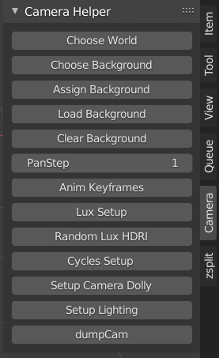

# bpyautoqueue

## Introduction 
bpyautoqueue is a set of tools for automation of blender baking, rendering and scene setup.

There are 4 parts to the bpyautoqueue set of tools:
* Render Queue
* Bake Queue
* Camera Helper UI
* Queue Helper UI


## Camera Helper


## Queue Helper


## Render Queue

The command `blq --brief` will display a brief summary of the current render queue:

```
Opening database: /home/blender/bpyautoqueue/render_db.sqlite3
CYCLES: Queued 16545
CYCLES: Finished 7305
```

## Bake Queue

The bake queue is managed with the `blb` command. 

The typical work sequeunce is:

* Add files to bake queue with `blb --search` option
* Assign draft settings to each file with `blb --setupdraft`
* Bake fluid in blender files with `blb --bake`
* After results are satisfactory upscale to final settings with `blb --setupfinal`
* Bake fluids again with `blb --bake`

The draft and final settings have different resolution, timesteps, and subframe assignments.

The command `blb --help` will display a list of options:
```
====================================
-p --print		| print all files
-b --brief		| brief summary of DB
--bake		| bake remaining files in queue
--setupdraft		| setup draft settings
--setupfinal		| setup final settings
--clean		| clean particles
--clearresults		| delete all bake results
--results -r		Print bake results
-s --searchpath		| add files to DB
--clearjobs			| clear DB
--markallfinished	| mark all files as finished
--requeueall		| requeue all jobs
--requeuefailed		| requeue failed jobs
```

The command `blb -r` will display bake results:

```
================== Results =================
2021-08-27 14:55 baketime: 03:35:08, frames: 250, resolution: 120, domain: (0.7,0.7,0.4), cache: 63G, filename: 2012_figure_splash.blend 
2021-08-27 17:42 baketime: 02:46:56, frames: 400, resolution: 120, domain: (6.0,2.1,0.1), cache: 112G, filename: 2021_02_honey_twist_concave.blend 
2021-08-27 19:45 baketime: 02:03:34, frames: 400, resolution: 120, domain: (7.0,4.0,4.0), cache: 298M, filename: 2021_02_honey_twist_concave_roller.blend 
2021-08-27 19:46 baketime: 08:23:32, frames: 400, resolution: 120, domain: (8.0,6.0,6.0), cache: 5.6G, filename: 2021_02_honey_grid_orbs.blend 
2021-08-27 19:46 baketime: 08:25:40, frames: 300, resolution: 120, domain: (6.0,6.0,6.0), cache: 35G, filename: 2020_02_16_water.blend 
```

The command `blb --bake` will bake all fluid files in the queue. Sometimes a fluid bake operation will not use all threads because of collision physics so multiple instances of the bake command can be run in different consoles.

The command `blb --search test/` will search the `test` directory for any matching blend files and add them to the bake queue.

The command `blb -p` will print the current bake queue:
```
Opening database: /home/ek/data/workspace/bpyautoqueue/bake_db.sqlite3
================== BakeDB =================
#1 status: Queued file: test/test2.blend
#2 status: Queued file: test/test1.blend
Finished Count: 0
Queued Count: 2
Processing Count: 0
Total count: 2
```

The command `blb --setupdraft` will iterate through all files currently in the queue and assign draft fluid settings. The fluid settings are defined in the file `bake_fluids.py` and currently set to subdivision 32 for draft settings. This is useful to configure a series of blend files for preview fluid behavior before baking at higher resolution. 

The command `blb --setupfinal` will iterate through all files currently in the queue and assign draft fluid settings. The fluid settings are defined in the file `bake_fluids.py` and currently set to subdivision 64 for draft settings. 


The command `blb --clear` will clear all records from the bake queue. 

## Installation

An automated install package is not availible at this time. If you copy this repository into your:
`blender_installation_directory/addons/scripts/bpyautoqueue` directory you should see bpyautoqueue in the list of blender addons next time you start blender. 